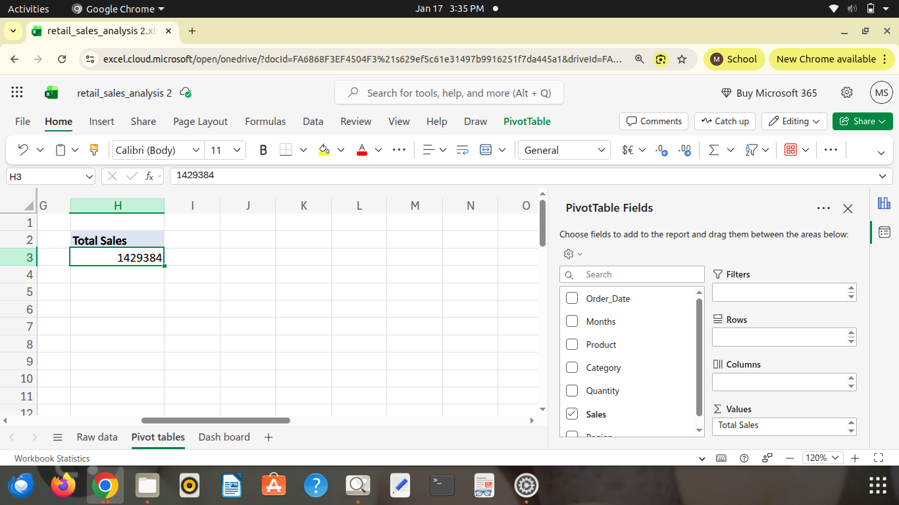
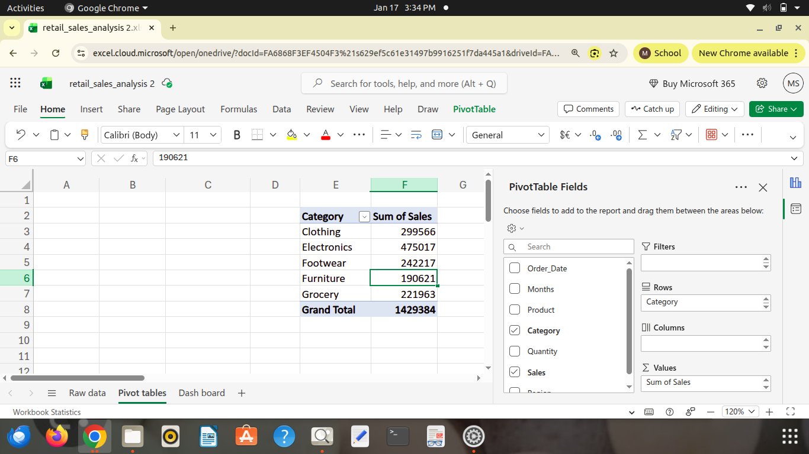
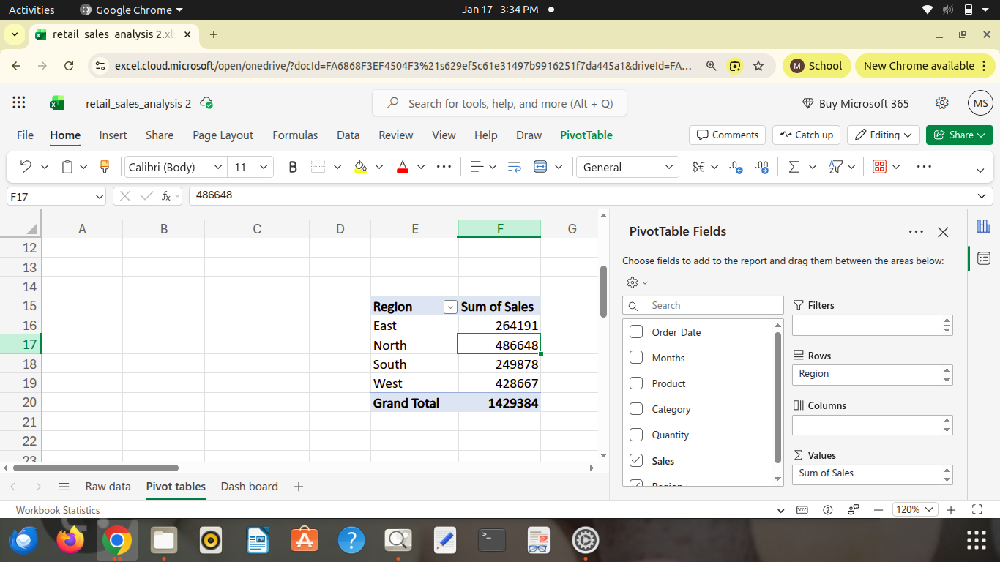
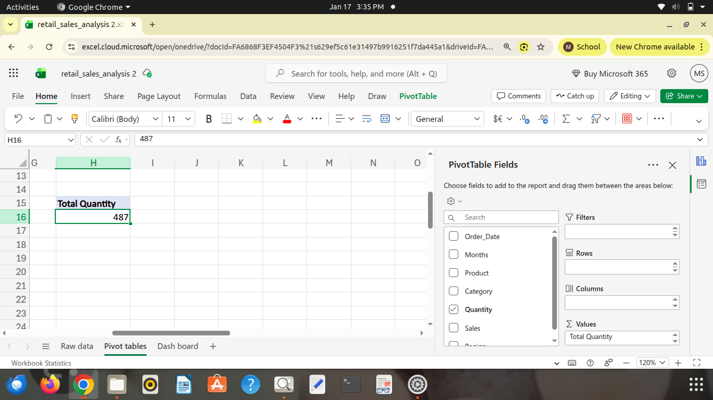
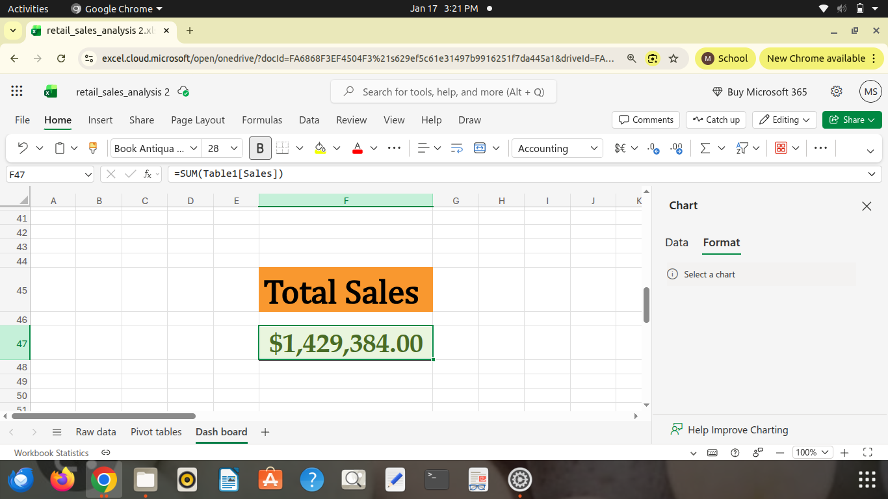
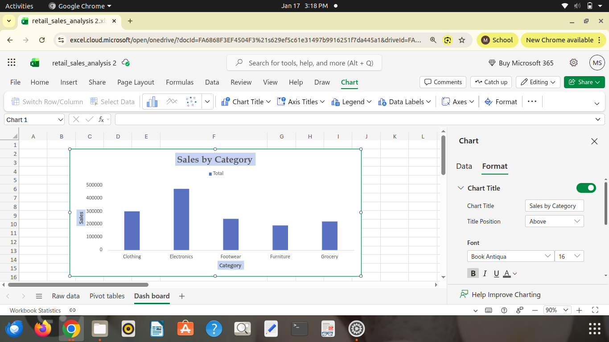
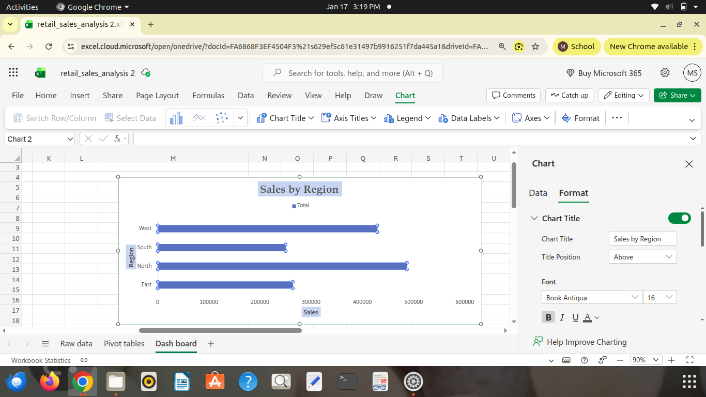
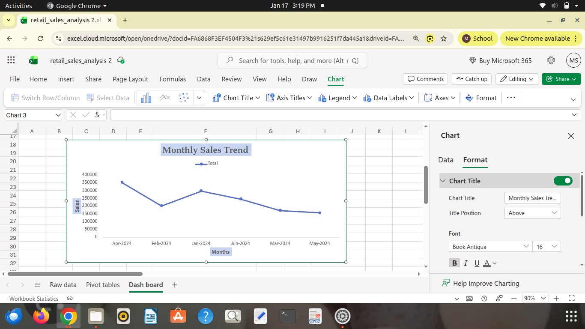
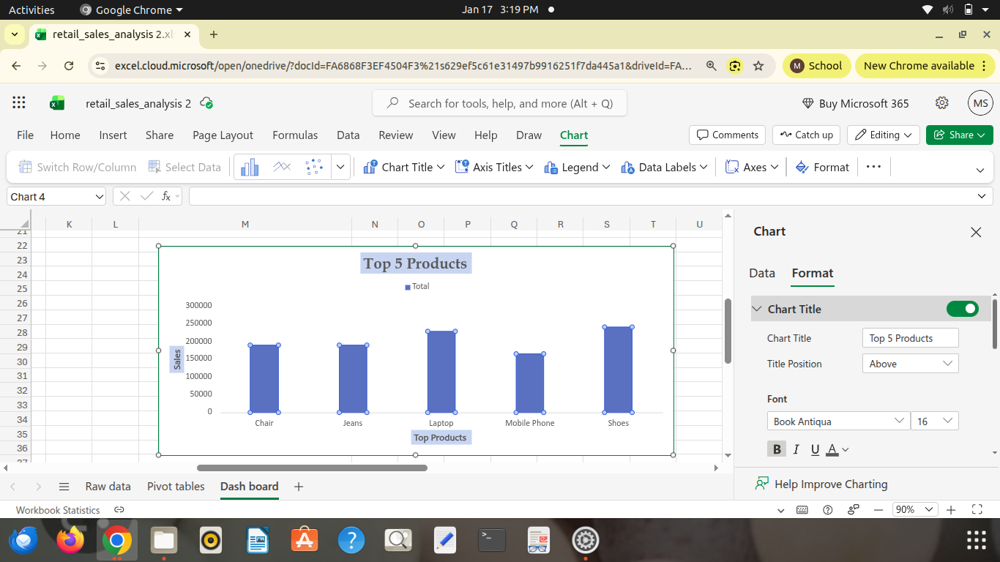
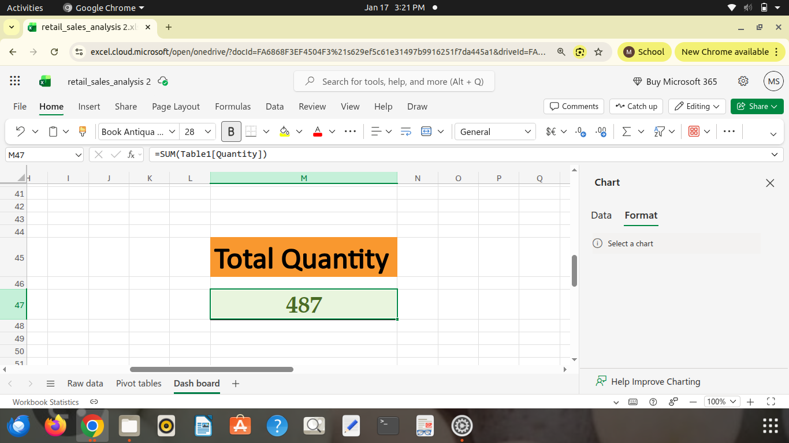

## Pivot Table 1: Total Sales

## Pivot Table 2: Sales by Category

## Pivot Table 3: Sales by Region

## Pivot Table 4: Monthly Sales Trend

## Pivot Table 5: Top 5 Products by Sales

## Pivot Table 6: Total Quantity

## KPI Card 1

## Dashboard Chart: Sales by Category

## Dashboard Chart: Sales by Region

## Dashboard Chart: Monthly Sales Trend

## Dashboard Chart: Top 5 Products

## KPI Card 2

